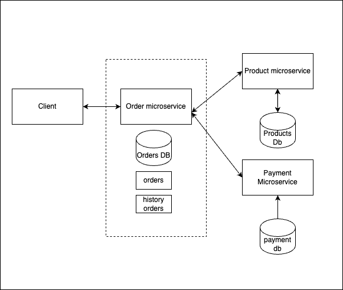
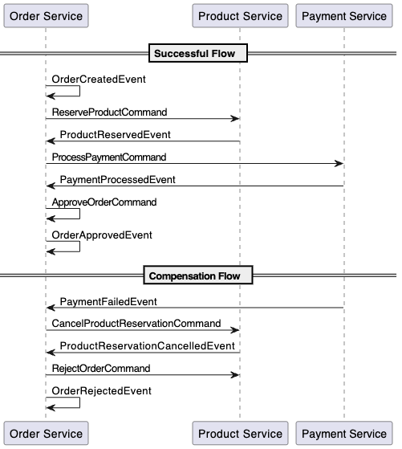
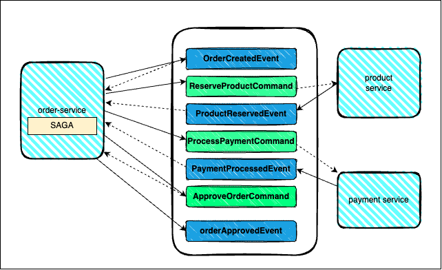
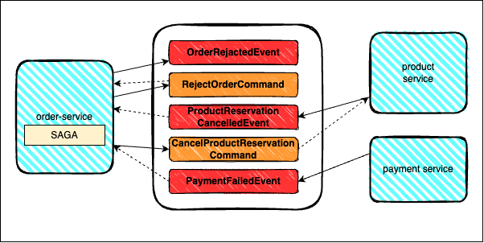

# Saga Pattern with Kafka

This simple project demonstrates the implementation of the **Saga Pattern** using **Apache Kafka** for managing distributed transactions across multiple services. 
The goal is to handle long-running business processes while ensuring data consistency and reliability. 
In case of failure, **compensating transactions** are triggered to revert actions, ensuring the system remains in a consistent state.

## Features
- **Kafka-based communication** between services.
- **Saga Pattern** for managing distributed transactions.
- **Compensating Transactions** to handle failures and maintain consistency.
- **Event-driven architecture** for seamless communication between services.

## Requirements

- **Java 17**
- **Maven 3.9.3**
- **Docker**

## Installation

1 Build the project using Maven:

```bash
mvn clean install
```

2 Run Kafka cluster

```bash
docker-compose up -d
```

2 Run the all services:

```bash
cd {module-name}
mvn spring-boot:run
```

## How it works

- The project uses the **Saga Pattern** to manage multi-step business workflows.
- Kafka is used as the event bus for communication between services.
- The application handles events such as order creation, product reservation, payment processing, and compensates failed transactions through rollback operations.

## Workflow example
1. Import postman collection
2. create product
3. place order (set product id equal to id from response in prev step)
4. track status in history table 
``http://localhost:8080/orders/{orderId}/history``

in case of credit card service unavailable(stopped) or order quantity>created product quantity transaction will be rolled back. Status is stored in 


## to track events in kafka topics:
```bash
docker exec -it kafka-1 /opt/bitnami/kafka/bin/kafka-console-consumer.sh --bootstrap-server kafka-1:9192 --topic {topic-name} --from-beginning
```

## Architecture


## Saga sequence diagramm



## Happy path



## Unhappy path

